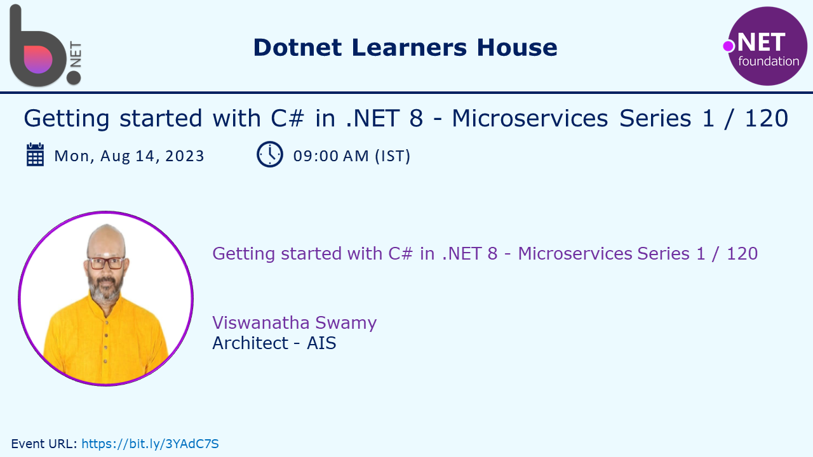
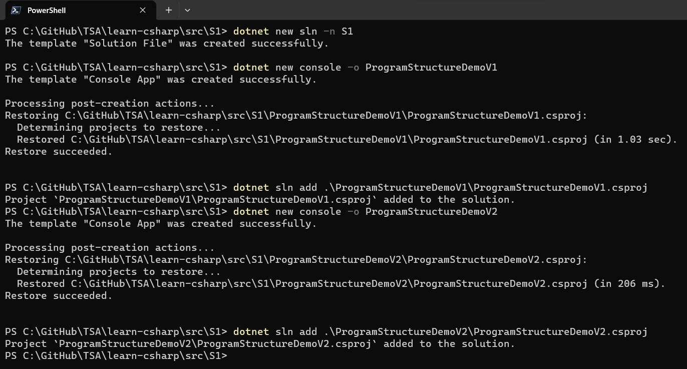
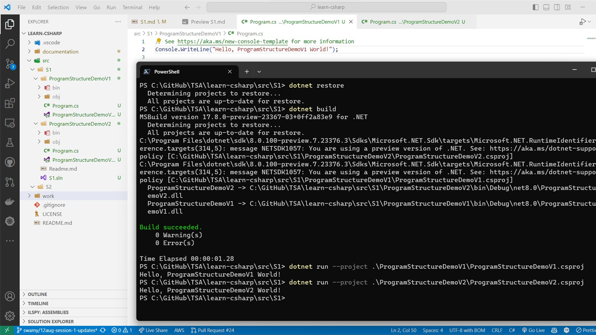

# C# Fundamentals - Part of Microservices Series - Session 1 of 120

## Date: 14-Aug-2023

## Event URL: [https://www.meetup.com/dot-net-learners-house-hyderabad/events/294980880](https://www.meetup.com/dot-net-learners-house-hyderabad/events/294980880)



## Agenda for this session

> 1. What is .NET?
> 1. .NET History
> 1. 30,000 foot view of .NET Common Language Runtime (CLR), BCL, CoreCLR, and CoreFX basics
> 1. C# Language
> 1. Exploring a few basic .NET CLI commands, Project Templates
> 1. Preparing Folder, Solution, Project(s)
> 1. Creating Console Application without Top Level Statements
> 1. Exploring Program Structure
> 1. Exploring Project Structure
> 1. Creating Console Application with Top Level Statements
> 1. Viewing the `<Main>$()` method
> 1. SUMMARY / RECAP / Q&A
> 1. What is next?

---


---

**Reference(s):**

> 1. [https://learn.microsoft.com/en-us/dotnet/core/introduction](https://learn.microsoft.com/en-us/dotnet/core/introduction)
> 1. [https://en.wikipedia.org/wiki/.NET_Framework_version_history#](https://en.wikipedia.org/wiki/.NET_Framework_version_history#)
> 1. [https://en.wikipedia.org/wiki/.NET](https://en.wikipedia.org/wiki/.NET)
> 1. [https://dotnet.microsoft.com/en-us/learn/csharp](https://dotnet.microsoft.com/en-us/learn/csharp)
> 1. [https://learn.microsoft.com/en-gb/dotnet/csharp/language-reference/](https://learn.microsoft.com/en-gb/dotnet/csharp/language-reference/)
> 1. [https://learn.microsoft.com/en-gb/dotnet/api/?view=net-7.0&term=System.Console](https://learn.microsoft.com/en-gb/dotnet/api/?view=net-7.0&term=System.Console)
> 1. [https://learn.microsoft.com/en-us/dotnet/](https://learn.microsoft.com/en-us/dotnet/)
> 1. [https://learn.microsoft.com/en-us/dotnet/csharp/language-reference/builtin-types/integral-numeric-types](https://learn.microsoft.com/en-us/dotnet/csharp/language-reference/builtin-types/integral-numeric-types)

## 1. What is .NET?

> 1. .NET is a free, cross-platform, open source developer platform for building many different types of applications.
> 1. With .NET, you can use multiple languages, editors, and libraries to build for web, mobile, desktop, games, and IoT.
> 1. .NET is supported by Microsoft. Microsoft ships official releases that are built and tested on Microsoft-maintained servers in Azure and supported just like any Microsoft product.

**Reference(s):**

> 1. [https://dotnet.microsoft.com/en-us/learn/dotnet/what-is-dotnet](https://dotnet.microsoft.com/en-us/learn/dotnet/what-is-dotnet)

## 2. .NET History

### 2.1. .NET Framework

> 1. Discussion [https://en.wikipedia.org/wiki/.NET_Framework_version_history#](https://en.wikipedia.org/wiki/.NET_Framework_version_history#)

### 2.2. .NET Core 1.0 to 3.1, and .NET 5/6/7/8 and above

> 1. Discussion [https://en.wikipedia.org/wiki/.NET](https://en.wikipedia.org/wiki/.NET)
> 1. .NET includes a cross-platform implementation of the CLR known as CoreCLR and a streamlined BCL known as CoreFX.
> 1. Releases Long Term Support (LTS), Standard Term Support (STS)

## 3. 30,000 foot view of .NET Common Language Runtime (CLR), BCL, CoreCLR, CoreFX basics

> 1. CLR is the virtual machine component of Microsoft's .NET framework and is responsible for managing the execution of .NET programs.
> 1. It provides core services such as memory management, thread management, and remoting, while also enforcing strict type safety and other forms of code accuracy that promote security and robustness.
> 1. It is a common language runtime that can be used by many programming languages, such as C#, F#, and Visual Basic.

**Reference(s):**

> 1. [https://learn.microsoft.com/en-us/dotnet/standard/clr](https://learn.microsoft.com/en-us/dotnet/standard/clr)
> 1. [https://learn.microsoft.com/en-us/dotnet/standard/managed-execution-process](https://learn.microsoft.com/en-us/dotnet/standard/managed-execution-process)
> 1. [https://en.wikipedia.org/wiki/Common_Language_Runtime](https://en.wikipedia.org/wiki/Common_Language_Runtime)

## 4. C# Language

> 1. C# is a modern, object-oriented programming language developed by Microsoft.
> 1. C# is a multi-paradigm programming language.
> 1. Program class is the entry point for every C# application and is required for every C# application.
> 1. C# is case sensitive. (C# is case sensitive. This means that uppercase and lowercase letters are treated differently.)
> 1. C# is commonly used for building Windows applications, web services, and games.
> 1. Code Indentation is not required in C#. But it is recommended to use proper indentation to make the code more readable.

## 5. Exploring few basic .NET CLI commands, Project Templates

> 1. Discussion and Demo

```bash
dotnet --info

dotnet --list-sdks 

dotnet --list-runtimes 

dotnet --version

dotnet new

dotnet new list

dotnet new --help
```

## 6. Preparing Folder, Solution, Project(s)

**Note:**

> 1. We will be using Visual Studio Code as our IDE for this course.
> 1. We will be learning Debugging using Visual Studio Code in **next session**.

A C# project refers to a structured collection of source code files, resources, configurations, and settings that together constitute a software application or library developed using the C# programming language. In a C# project, you organize and manage your code and related assets in a way that facilitates development, compilation, testing, and deployment.

A C# project serves as a container for your code and related assets, providing an organized and manageable way to develop and build your software. It also plays a crucial role in integrating your code with build tools, version control systems, and other development processes.

### 6.1. Create Solution and Project(s)

```powershell
dotnet new sln -n S1

dotnet new console -o ProgramStructureDemoV1
dotnet sln add .\ProgramStructureDemoV1\ProgramStructureDemoV1.csproj

dotnet new console -o ProgramStructureDemoV2
dotnet sln add .\ProgramStructureDemoV2\ProgramStructureDemoV2.csproj
```



### 6.2. Execute the Project(s)

> 1. **dotnet restore**: Command to restore the NuGet packages and dependencies specified in the project file.
> 1. **dotnet build**: Command to compile the source code and create executable files or libraries.
> 1. **dotnet run**: Command to build and run the application in a single step, compiling and executing the code.

```powershell
dotnet restore
dotnet build
dotnet run --project .\ProgramStructureDemoV1\ProgramStructureDemoV1.csproj

dotnet run --project .\ProgramStructureDemoV2\ProgramStructureDemoV2.csproj
```



## 7. Modifying `ProgramStructureDemoV1.csproj` Console Application with Main() Method

```bash
dotnet new console -o FirstCSharpProgram --use-program-main
```

## 8. Exploring Program Structure

> 1. Comments - Single line comments (//) and Multi-line comments (/*ddd*/).
> 1. Statements, Statements and Expressions (sum = num1 + num2; num1 + num2 is an expression). Statement terminates with semicolon (;).
> 1. Block of code is a set of statements that are grouped together using curly braces ({ and }). Block of code is also called as code block.
> 1. A namespace contains types like classes to group them together.
> 1. A class contains the members of an object, including methods.
> 1. A method contains statements that implement an action that an object can take.
> 1. Keywords are reserved words that have special meaning in the language. You cannot use a keyword as an identifier, such as the name of a variable, method, or class.
> 1. A variable is a name that you create to store a value. To create a variable, you must specify the type and assign it a value. It should be in camelCase.
> 1. Global Usings - using System; using System.Collections.Generic; using System.Linq; using System.Text; using System.Threading.Tasks;
> 1. Local Usings - using System; using System.Collections.Generic; using System.Linq; using System.Text; using System.Threading.Tasks;
> 1. A namespace contains types like classes to group them together.
> 1. A class contains the members of an object, including methods.
> 1. A method contains statements that implement an action that an object can take.
> 1. The Main method is the entry point of a C# application. (There can only be one entry point in a C# program.)
> 1. .csproj file is the project file for C# projects. It contains all the information that's required to build your project.
> 1. .sln file is the solution file for Visual Studio. It contains information about one or more projects.
> 1. Top-level statements are statements that aren't inside any type or namespace.
> 1. They are supported in Program.cs file. It should be as part of entry point and one application should have only one entry point.
> 1. The dot operator (.) is used to access members of a namespace, type, or object.
> 1. Demos -> ProgramStructureDemo.csproj.

## 9. Exploring Project Structure

> 1. **Source Code Files**: These are the actual C# code files (.cs files) that contain the classes, methods, properties, and other program components.
> 1. **Project File**: This is a configuration file (with a .csproj extension) that defines the project structure, dependencies, references, compilation settings, and other project-specific details. It's used by the build system to manage the project.
> 1. **Solution File**: If you're working with multiple projects that are interrelated, you might organize them in a Visual Studio solution file (.sln). This helps manage and build multiple projects together.
> 1. **References**: C# projects can reference external libraries, assemblies, and packages that provide additional functionality. These references are specified in the project file.
> 1. **Settings and Configurations**: Projects can include settings files that store configuration data used by the application.
> 1. **Output**: The compiled output of the project, such as executable files (.exe) for applications or library files (.dll) for class libraries.
> 1. **bin folder**: This folder contains the compiled output files, such as executable (.exe) or library (.dll) files, produced by building the project.
> 1. **obj folder**: This folder holds intermediate build files created during the build process, including object files and metadata, used to create the final output in the bin folder.

## 10. Creating `ProgramStructureDemoV2.csproj` Console Application with Top Level Statements

> 1. Discussion and Demo

## 11. Viewing the `<Main>$()` method

> 1. Discussion and Demo

## X. SUMMARY / RECAP / Q&A

> 1. Discussion and Demo

---

## X. What is next ?

> 1. Introduction to Variables
> 1. Showing Compiler Version `#error version`
> 1. ilDasm Demo
> 1. `Global namespace imports` feature
> 1. `File-scoped namespaces` feature
> 1. Common Language Infrastructure (CLI)
> 1. Creating a Console Application with .NET (6/7/8)
> 1. Creating a Console Application with global.json inside folder
> 1. Importing Namespaces
> 1. Notification Icon
> 1. Multiple Projects
> 1. SUMMARY / RECAP / Q&A
> 1. What is next ?

## Next Session

> 1. Top-level statements are statements that aren't inside any type or namespace. They can be used to declare variables and their types, define functions, and define classes.

## 1. Console Application with and without Top Level Statements

> 1. Discussion and Demo

### 1.1 Without Top Level Statements

```bash
dotnet new console -o demo1 --use-program-main
```


### 1.2. With Top Level Statements

> 1. Top level Statements, will create `Program` class, and `<Main>$()` method

```bash
dotnet new console -o demo2
```

```csharp
using System;
using System.Runtime.CompilerServices;

[CompilerGenerated]
internal class Program
{
    private static void <Main>$(string[] args)
    {
        Console.WriteLine("Hello, World!");
    }
}
```


