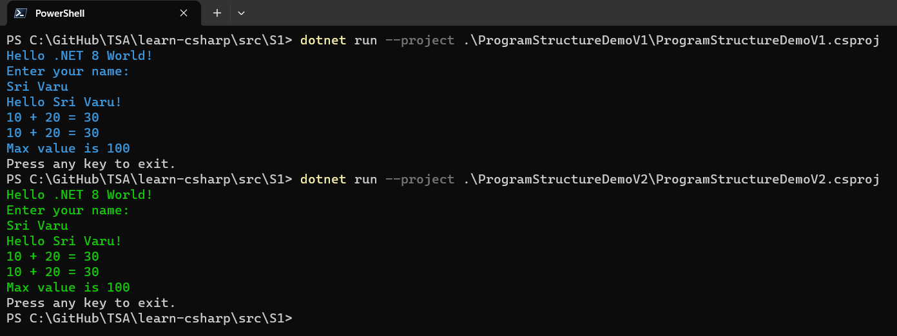
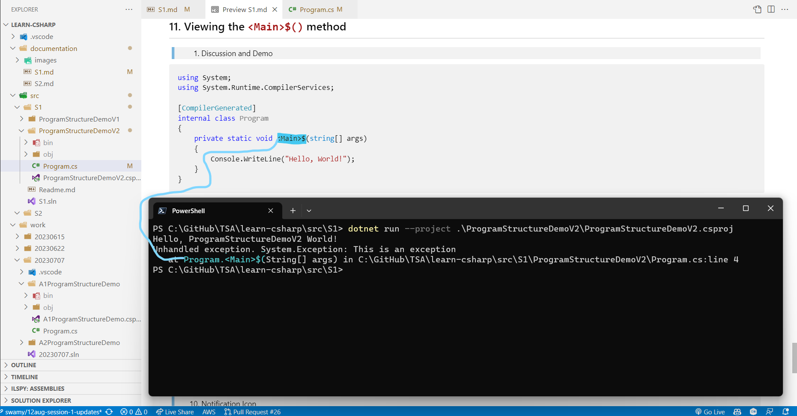

# C# Fundamentals - Part of Microservices Series - Session 1 of 120

## Date: 14-Aug-2023

## Event URL: [https://www.meetup.com/dot-net-learners-house-hyderabad/events/294980880](https://www.meetup.com/dot-net-learners-house-hyderabad/events/294980880)


## Agenda for this session

> 1. To be decided
> 1. SUMMARY / RECAP / Q&A
> 1. What is next?

---


---

## X. Preparing Folder, Solution, Project(s)

### X.X. Create Solution

```powershell
dotnet new sln -n S2
```

### X.X. Copy two projects from S1 folder to S2 folder and add them to the solution

```powershell
dotnet sln add .\ProgramStructureDemoV1\ProgramStructureDemoV1.csproj

dotnet sln add .\ProgramStructureDemoV2\ProgramStructureDemoV2.csproj
```


### X.X. Create New Console Project, Class Library (VB) and them to the solution S2

```powershell
dotnet new console -o ProgramStructureDemoV3
dotnet sln add .\ProgramStructureDemoV3\ProgramStructureDemoV3.csproj

dotnet new classlib -o MathServices --language VB
dotnet sln add .\MathServices\MathServices.vbproj
```


### 6.2. Execute the Project(s)

> 1. **dotnet restore**: Command to restore the NuGet packages and dependencies specified in the project file.
> 1. **dotnet build**: Command to compile the source code and create executable files or libraries.
> 1. **dotnet run**: Command to build and run the application in a single step, compiling and executing the code.

```powershell
dotnet restore
dotnet build

dotnet run --project .\ProgramStructureDemoV1\ProgramStructureDemoV1.csproj

dotnet run --project .\ProgramStructureDemoV2\ProgramStructureDemoV2.csproj
```


## 7. Modifying `ProgramStructureDemoV1.csproj` Console Application with Main() Method

### 7.1. Services/Maths.cs

```csharp
namespace ProgramStructureDemoV1.Services
{
    public class Maths
    {
        public static int MaxValue = 100;

        public int AddNumbers(int a, int b)
        {
            return a + b;
        }

        public static int AddNumbersV1(int a, int b) => a + b;
    }
}
```

### 7.2. Program.cs

```csharp
/*
    File: Program.cs
    Author: Viswanatha Swamy
    Created On: 14-Aug-2023
*/

using System;
using ProgramStructureDemoV1.Services;

/// <summary>
/// This is a demo program to show the structure of a C# program.
/// </summary>
namespace ProgramStructureDemo
{
    // Program is a class is the container of the program. It is the entry point of the program.
    class Program
    {

        // Main method is the entry point of the program
        static void Main(string[] args)
        { /* Block of code Starts here */

            Console.WriteLine("Hello .NET 8 World!"); /* This is a statement and it ends with semi colon. */

            Console.WriteLine("Enter your name: ");
            var name = Console.ReadLine();
            Console.WriteLine($"Hello {name}!");

            int num1 = 10, num2 = 20; /* Variable declaration and initialization. */
            Maths maths = new(); /* Instantiation of Maths class. */
            Console.WriteLine($"{num1} + {num2} = {maths.AddNumbers(num1, num2)}");

            /* Accessing static members of a class. */
            Console.WriteLine($"{num1} + {num2} = {Maths.AddNumbersV1(num1, num2)}");
            Console.WriteLine($"Max value is {Maths.MaxValue}");

            /* The dot operator (.) is used to access members of a namespace, type, or object. */
            Console.WriteLine("Press any key to exit.");
            Console.ReadKey();

            // Console.ReadKey(); & Console.Readkey(); are different /* C# is a case sensitive language. */

        } /* Block of code Ends here */
    }

}
```



## 8. Exploring Program Structure

> 1. Comments - Single line comments (`//`) and Multi-line comments (`/*ddd*/`).
> 1. Statements, Statements and Expressions (sum = num1 + num2; num1 + num2 is an expression). Statement terminates with semicolon (;).
> 1. Keywords are reserved words that have special meaning in the language. You cannot use a keyword as an identifier, such as the name of a variable, method, or class.
> 1. Block of code is a set of statements that are grouped together using curly braces ({ and }). Block of code is also called as code block.
> 1. A method contains statements that implement an action that an object can take.
> 1. A class contains the members of an object, including methods.
> 1. A namespace contains types like classes to group them together.
> 1. A variable is a name that you create to store a value. To create a variable, you must specify the type and assign it a value. It should be in camelCase.
> 1. Local Usings in C# allow importing namespaces like 'System' and 'System.Collections.Generic' to access their classes and functionality within a specific code block.
> 1. The Main method is the entry point of a C# application. (There can only be one entry point in a C# program.)
> 1. Top-level statements are statements that aren't inside any type or namespace. They are supported in Program.cs file. It should be as part of entry point and one application should have only one entry point.
> 1. The dot operator (.) is used to access members of a namespace, type, or object.

## 9. Exploring Project Structure

> 1. **Source Code Files**: These are the actual C# code files (.cs files) that contain the classes, methods, properties, and other program components.
> 1. **Project File**: This is a configuration file (with a .csproj extension) that defines the project structure, dependencies, references, compilation settings, and other project-specific details. It's used by the build system to manage the project.
> 1. **Solution File**: If you're working with multiple projects that are interrelated, you might organize them in a Visual Studio solution file (.sln). This helps manage and build multiple projects together.
> 1. **References**: C# projects can reference external libraries, assemblies, and packages that provide additional functionality. These references are specified in the project file.
> 1. **Settings and Configurations**: Projects can include settings files that store configuration data used by the application.
> 1. **Output**: The compiled output of the project, such as executable files (.exe) for applications or library files (.dll) for class libraries.
> 1. **bin folder**: This folder contains the compiled output files, such as executable (.exe) or library (.dll) files, produced by building the project.
> 1. **obj folder**: This folder holds intermediate build files created during the build process, including object files and metadata, used to create the final output in the bin folder.

## 10. Creating `ProgramStructureDemoV2.csproj` Console Application with Top Level Statements

### 10.1. Program.cs

```csharp
using ProgramStructureDemoV2.Services;

// Uncomment the following line to see the exception with Program.<Main>$(String[] args) method.
// throw new Exception("This is an exception");

Console.ForegroundColor = ConsoleColor.Green;

Console.WriteLine("Hello .NET 8 World!"); /* This is a statement and it ends with semi colon. */

Console.WriteLine("Enter your name: ");
var name = Console.ReadLine();
Console.WriteLine($"Hello {name}!");

int num1 = 10, num2 = 20; /* Variable declaration and initialization. */
Maths maths = new(); /* Instantiation of Maths class. */
Console.WriteLine($"{num1} + {num2} = {maths.AddNumbers(num1, num2)}");

/* Accessing static members of a class. */
Console.WriteLine($"{num1} + {num2} = {Maths.AddNumbersV1(num1, num2)}");
Console.WriteLine($"Max value is {Maths.MaxValue}");

Console.ResetColor();

/* The dot operator (.) is used to access members of a namespace, type, or object. */
Console.WriteLine("Press any key to exit.");
Console.ReadKey();
```


## 11. Viewing the `<Main>$()` method

> 1. Discussion and Demo

```csharp
using System;
using System.Runtime.CompilerServices;

[CompilerGenerated]
internal class Program
{
    private static void <Main>$(string[] args)
    {
        Console.WriteLine("Hello, World!");
    }
}
```



## X. SUMMARY / RECAP / Q&A

> 1. Discussion and Demo

---

## X. What is next?

> 1. Introduction to Variables
> 1. Showing Compiler Version `#error version`
> 1. ilDasm Demo
> 1. `Global namespace imports` feature
> 1. `File-scoped namespaces` feature
> 1. Common Language Infrastructure (CLI)
> 1. Creating a Console Application with .NET (6/7/8)
> 1. Creating a Console Application with global.json inside folder
> 1. Importing Namespaces
> 1. Notification Icon
> 1. Multiple Projects
> 1. SUMMARY / RECAP / Q&A
> 1. What is next?
