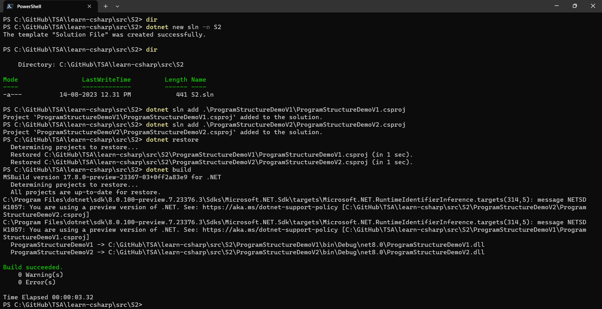
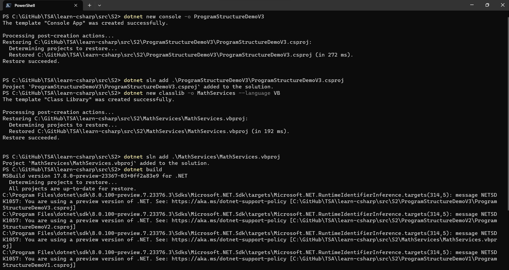
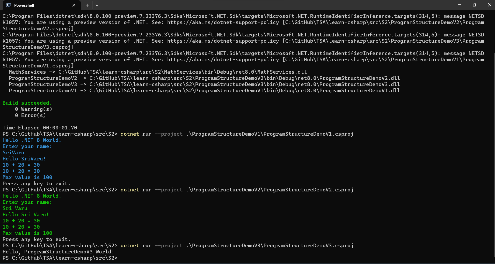
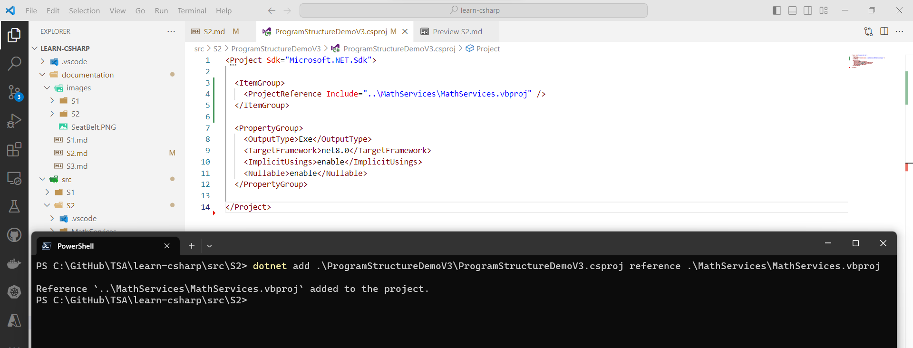
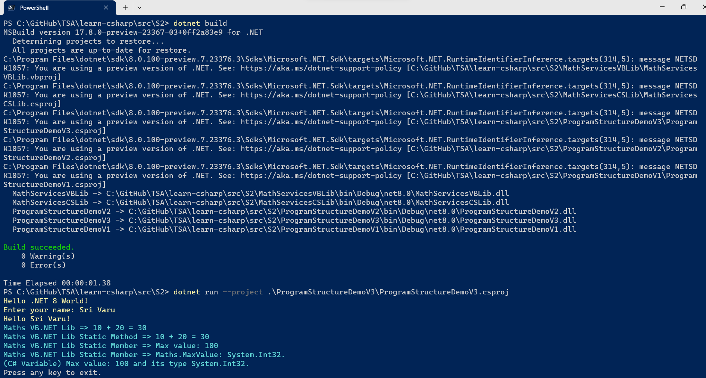
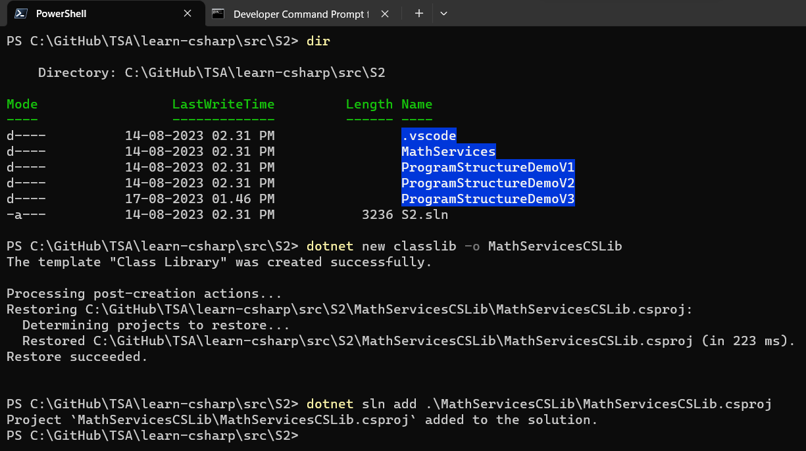
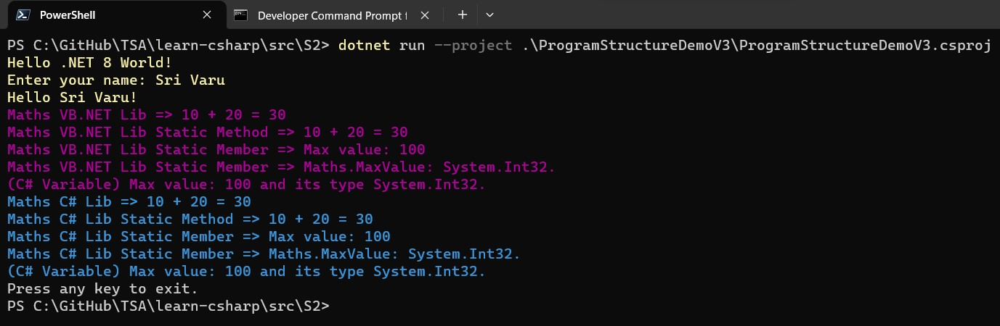

# C# Fundamentals - Part of Microservices Series - Session 1 of 120

## Date: 28-Aug-2023

## Event URL: [https://www.meetup.com/dot-net-learners-house-hyderabad/events/294980994](https://www.meetup.com/dot-net-learners-house-hyderabad/events/294980994)

## YouTube URL: [https://www.youtube.com/watch?v=VxMY7FMm_JQ](https://www.youtube.com/watch?v=VxMY7FMm_JQ)


## Agenda for this session

> 1. Preparing Folder, Solution, Project(s)
> 1. - Create a New Solution
> 1. - Copy two existings projects from S1 folder to S2 folder and add them to the solution
> 1. Create a New Console Project (C#), Class Library (VB) and them to the solution S2
> 1. - Creating a New Console Project (C#) and add it to the solution S2
> 1. - Creating a New Class Library (VB) and add it to the solution S2
> 1. Executing three Console Project(s)
> 1. Modify the MathServices Library and add it to the ProgramStructureDemoV3 Project
> 1. - Modify the MathServices Library
> 1. - Add MathServices Library reference to the ProgramStructureDemoV3 Project
> 1. Modify the ProgramStructureDemoV3 Project and Execute
> 1. - Modify the ProgramStructureDemoV3 Project
> 1. - Execute the ProgramStructureDemoV3 Project
> 1. Dive into understanding "How it was possible to use VB.NET Library in C# Project?"
> 1. Dive into understanding "What is Common Language Infrastructure?"
> 1. Dive into understanding "JIT Compilation" Process
> 1. SUMMARY / RECAP / Q&A
> 1. What is next?

---


---

## 1. Preparing Folder, Solution, Project(s)

> 1. Discussion and demo

### 1.1. Create a New Solution

```powershell
dotnet new sln -n S2
```

### 1.2. Copy two existings projects from S1 folder to S2 folder and add them to the solution

```powershell
dotnet sln add .\ProgramStructureDemoV1\ProgramStructureDemoV1.csproj

dotnet sln add .\ProgramStructureDemoV2\ProgramStructureDemoV2.csproj
```



## 2. Create a New Console Project (C#), Class Library (VB) and them to the solution S2

> 1. Discussion and demo

### 2.1. Creating a New Console Project (C#) and add it to the solution S2

```powershell
dotnet new console -o ProgramStructureDemoV3
dotnet sln add .\ProgramStructureDemoV3\ProgramStructureDemoV3.csproj
```

### 2.2. Creating a New Class Library (VB) and add it to the solution S2

```powershell
dotnet new classlib -o MathServices --language VB
dotnet sln add .\MathServices\MathServices.vbproj
```



## 3. Executing three Console Project(s)

> 1. Discussion and demo

```powershell
dotnet build

dotnet run --project .\ProgramStructureDemoV1\ProgramStructureDemoV1.csproj

dotnet run --project .\ProgramStructureDemoV2\ProgramStructureDemoV2.csproj

dotnet run --project .\ProgramStructureDemoV3\ProgramStructureDemoV3.csproj
```



## 4. Modify the MathServices Library and add it to the ProgramStructureDemoV3 Project

> 1. Discussion and demo

### 4.1. Modify the MathServices Library

```vb
Namespace MathLibrary
    Public Class Maths
        Public Shared MaxValue As Integer = 100

        Public Function AddNumbers(a As Integer, b As Integer) As Integer
            Return a + b
        End Function

        Public Shared Function AddNumbersV1(a As Integer, b As Integer) As Integer
            Return a + b
        End Function
    End Class
End Namespace
```

### 4.2. Add MathServices Library reference to the ProgramStructureDemoV3 Project

```powershell
dotnet add .\ProgramStructureDemoV3\ProgramStructureDemoV3.csproj reference .\MathServices\MathServices.vbproj
```

OR

```xml
  <ItemGroup>
    <ProjectReference Include="..\MathServices\MathServices.vbproj" />
  </ItemGroup>
```



## 5. Modify the ProgramStructureDemoV3 Project and Execute

> 1. Discussion and demo

### 5.1. Modify the ProgramStructureDemoV3 Project

```csharp
/* 
    Using VB.NET style namespace aliasing. We are using VB.NET Library in this C# program.
*/
using MathServices.MathLibrary;

Console.ForegroundColor = ConsoleColor.Yellow;

Console.WriteLine("Hello .NET 8 World!"); /* This is a statement and it ends with semi colon. */

Console.WriteLine("Enter your name: ");
var name = Console.ReadLine();
Console.WriteLine($"Hello {name}!");

int num1 = 10, num2 = 20; /* Variable declaration and initialization. */
Maths maths = new(); /* Instantiation of Maths class. */
Console.WriteLine($"{num1} + {num2} = {maths.AddNumbers(num1, num2)}");

/* Accessing static members of a class. */
Console.WriteLine($"{num1} + {num2} = {Maths.AddNumbersV1(num1, num2)}");
Console.WriteLine($"Max value is {Maths.MaxValue}");

Console.ResetColor();

/* The dot operator (.) is used to access members of a namespace, type, or object. */
Console.WriteLine("Press any key to exit.");
Console.ReadKey();
```

### 5.2. Execute the ProgramStructureDemoV3 Project

```powershell
dotnet run --project .\ProgramStructureDemoV3\ProgramStructureDemoV3.csproj
```



## 6. Creating a New Class Library (C#)

```powershell
dotnet new classlib -o MathServicesCSLib
dotnet sln add .\MathServicesCSLib\MathServicesCSLib.csproj
```



### 6.1. Update the code of MathServicesCSLib

```cs
namespace MathServicesCSLib;

public class Maths
{
    public static int MaxValue = 100;

    public int AddNumbers(int a, int b)
    {
        return a + b;
    }

    public static int AddNumbersV1(int a, int b) => a + b;
}
```

### 6.2. Add MathServicesCSLib Library reference to the ProgramStructureDemoV3 Project

```powershell
dotnet add .\ProgramStructureDemoV3\ProgramStructureDemoV3.csproj reference .\MathServicesCSLib\MathServicesCSLib.csproj
```

OR

```xml
  <ItemGroup>
    <ProjectReference Include="..\MathServices\MathServices.vbproj" />
    <ProjectReference Include="..\MathServicesCSLib\MathServicesCSLib.csproj" />
  </ItemGroup>
```

### 6.3. Execute the ProgramStructureDemoV3 Project

```powershell
dotnet run --project .\ProgramStructureDemoV3\ProgramStructureDemoV3.csproj
```



## 6. Dive into understanding "How it was possible to use VB.NET Library in C# Project?"

> 1. Discussion and demo

**Reference(s):**

> 1. [https://learn.microsoft.com/en-us/dotnet/standard/common-type-system](https://learn.microsoft.com/en-us/dotnet/standard/common-type-system)
> 1. [https://learn.microsoft.com/en-us/dotnet/standard/language-independence](https://learn.microsoft.com/en-us/dotnet/standard/language-independence)
> 1. [https://learn.microsoft.com/en-us/dotnet/standard/base-types/common-type-system](https://learn.microsoft.com/en-us/dotnet/standard/base-types/common-type-system)
> 1. [https://learn.microsoft.com/en-us/dotnet/api/system.int32?view=net-7.0](https://learn.microsoft.com/en-us/dotnet/api/system.int32?view=net-7.0)

## 7. Dive into understanding "What is Common Language Infrastructure?"

> 1. Discussion and demo

**Reference(s):**

> 1. [https://en.wikipedia.org/wiki/Common_Language_Infrastructure#Implementations](https://en.wikipedia.org/wiki/Common_Language_Infrastructure#Implementations)

## 8. Dive into understanding "JIT Compilation" Process

> 1. Discussion and demo

**Reference(s):**

> 1. [https://en.wikipedia.org/wiki/Common_Language_Infrastructure#Implementations](https://en.wikipedia.org/wiki/Common_Language_Infrastructure#Implementations)

## X. SUMMARY / RECAP / Q&A

> 1. Discussion and Demo

---

## X. What is next?

> 1. ilDasm Demo
> 1. Dive into understanding "JIT Compilation" Process
> 1. Showing Compiler Version `#error version`
> 1. Introduction to Variables
> 1. `Global namespace imports` feature
> 1. `File-scoped namespaces` feature
> 1. Creating a Console Application with .NET (6/7/8)
> 1. Creating a Console Application with global.json inside folder
> 1. Importing Namespaces
> 1. Multiple Projects
> 1. SUMMARY / RECAP / Q&A
> 1. What is next?
