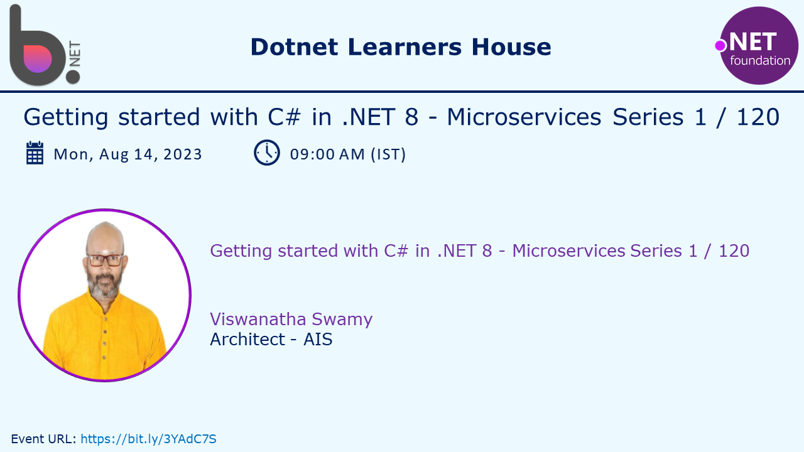

# C# Fundamentals - Part of Microservices Series - Session 1 of 120

## Date: 14-Aug-2023

## Event URL: [https://www.meetup.com/dot-net-learners-house-hyderabad/events/294980880](https://www.meetup.com/dot-net-learners-house-hyderabad/events/294980880)



## Agenda for this session

> 1. To be decided
> 1. SUMMARY / RECAP / Q&A
> 1. What is next?

---


---

## X. Preparing Folder, Solution, Project(s)

### X.X. Create Solution

```powershell
dotnet new sln -n S2
```

### X.X. Copy two projects from S1 folder to S2 folder and add them to the solution

```powershell
dotnet sln add .\ProgramStructureDemoV1\ProgramStructureDemoV1.csproj

dotnet sln add .\ProgramStructureDemoV2\ProgramStructureDemoV2.csproj
```


### X.X. Create New Console Project, Class Library (VB) and them to the solution S2

```powershell
dotnet new console -o ProgramStructureDemoV3
dotnet sln add .\ProgramStructureDemoV3\ProgramStructureDemoV3.csproj

dotnet new classlib -o MathServices --language VB
dotnet sln add .\MathServices\MathServices.vbproj
```


### X.X. Execute the Project(s)

```powershell
dotnet build

dotnet run --project .\ProgramStructureDemoV1\ProgramStructureDemoV1.csproj

dotnet run --project .\ProgramStructureDemoV2\ProgramStructureDemoV2.csproj

dotnet run --project .\ProgramStructureDemoV3\ProgramStructureDemoV3.csproj
```


## X. SUMMARY / RECAP / Q&A

> 1. Discussion and Demo

---

## X. What is next?

> 1. Introduction to Variables
> 1. Showing Compiler Version `#error version`
> 1. ilDasm Demo
> 1. `Global namespace imports` feature
> 1. `File-scoped namespaces` feature
> 1. Common Language Infrastructure (CLI)
> 1. Creating a Console Application with .NET (6/7/8)
> 1. Creating a Console Application with global.json inside folder
> 1. Importing Namespaces
> 1. Notification Icon
> 1. Multiple Projects
> 1. SUMMARY / RECAP / Q&A
> 1. What is next?
