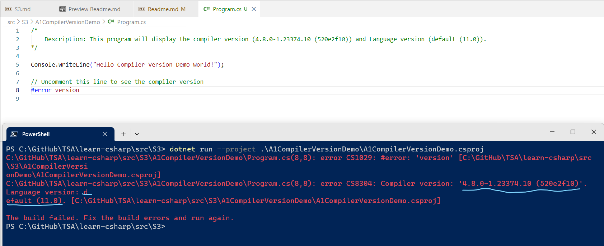
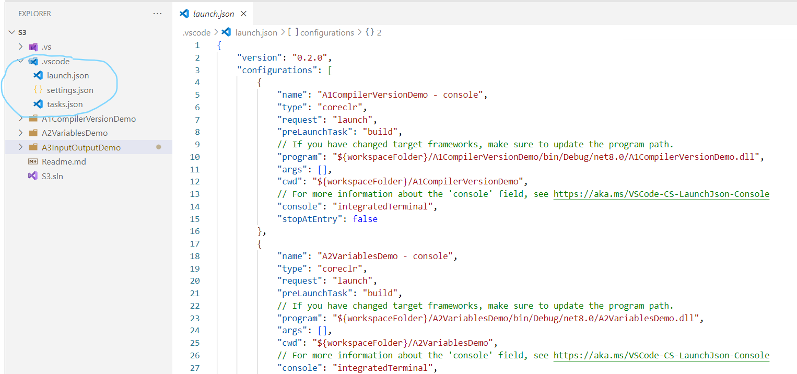
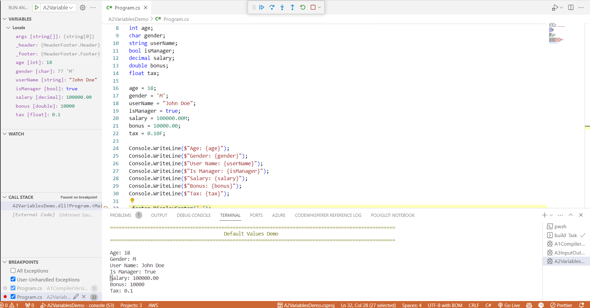

# Dive into Interoperability, and JIT Compilation, Debugging using VS Code - Part of Microservices Series 3/120

## Date: 11-Sep-2023

## Event URL: [https://www.meetup.com/dot-net-learners-house-hyderabad/events/295456840/](https://www.meetup.com/dot-net-learners-house-hyderabad/events/295456840/)

## YouTube URL: [https://www.youtube.com/watch?v=VxMY7FMm_JQ](https://www.youtube.com/watch?v=VxMY7FMm_JQ)


## Agenda for this session

> 1. Dive into "How it was possible to use VB.NET Library in C# Project?"
> 1. Dive into "JIT Compilation" Process
> 1. Showing Compiler Version `#error version` - A1CompilerVersionDemo.csproj
> 1. Multiple Projects by adding A2VariablesDemo.csproj and A3InputOutputDemo.csproj
> 1. Dive into "Debugging using VS Code"
>    - Adding .vscode folder
>    - Adding settings.json and setting up "dotnet.defaultSolution": "S3.sln"
>    - Adding tasks.json
>    - Adding launch.json
>    - Debugging using VS Code
> 1. Introduction to Variables
> 1. Importing Namespaces
> 1. `Global namespace imports` feature
> 1. `File-scoped namespaces` feature
> 1. Creating a Console Application with .NET (6/7/8)
> 1. Creating a Console Application with global.json inside folder
> 1. SUMMARY / RECAP / Q&A
> 1. What is next?

---


---

## 1. Dive into understanding "How it was possible to use VB.NET Library in C# Project?"

> 1. Discussion and demo

**Reference(s):**

> 1. [https://learn.microsoft.com/en-us/dotnet/standard/common-type-system](https://learn.microsoft.com/en-us/dotnet/standard/common-type-system)
> 1. [https://learn.microsoft.com/en-us/dotnet/standard/language-independence](https://learn.microsoft.com/en-us/dotnet/standard/language-independence)
> 1. [https://learn.microsoft.com/en-us/dotnet/standard/base-types/common-type-system](https://learn.microsoft.com/en-us/dotnet/standard/base-types/common-type-system)
> 1. [https://learn.microsoft.com/en-us/dotnet/api/system.int32?view=net-7.0](https://learn.microsoft.com/en-us/dotnet/api/system.int32?view=net-7.0)
> 1. [https://en.wikipedia.org/wiki/Common_Language_Infrastructure#Implementations](https://en.wikipedia.org/wiki/Common_Language_Infrastructure#Implementations)


## 2. Dive into understanding "JIT Compilation" Process

> 1. Discussion and demo

**Reference(s):**

> 1. [https://en.wikipedia.org/wiki/Common_Language_Infrastructure#Implementations](https://en.wikipedia.org/wiki/Common_Language_Infrastructure#Implementations)

## 3. Showing Compiler Version `#error version`

> 1. Discussion and demo

```powershell
dotnet new sln -n S3

dotnet new console -o A1CompilerVersionDemo
dotnet sln add .\A1CompilerVersionDemo\A1CompilerVersionDemo.csproj
dotnet restore
dotnet build
dotnet run --project .\A1CompilerVersionDemo\A1CompilerVersionDemo.csproj
```

```csharp
/*
    Description: This program will display the compiler version (4.8.0-1.23374.10 (520e2f10)) and Language version (default (11.0)).
*/

Console.WriteLine("Hello Compiler Version Demo World!");

// Uncomment this line to see the compiler version
// #error version
```



## 4. Multiple Projects by adding A2VariablesDemo.csproj and A3InputOutputDemo.csproj

> 1. Discussion and demo

```powershell
dotnet new console -o A2VariablesDemo
dotnet sln add .\A2VariablesDemo\A2VariablesDemo.csproj
dotnet add reference ../../Common/HeaderFooter/HeaderFooter.csproj
dotnet restore
dotnet build
dotnet run --project .\A2VariablesDemo\A2VariablesDemo.csproj

dotnet new console -o A3InputOutputDemo
dotnet sln add .\A3InputOutputDemo\A3InputOutputDemo.csproj
dotnet add reference ../../Common/HeaderFooter/HeaderFooter.csproj
dotnet restore
dotnet build
dotnet run --project .\A3InputOutputDemo\A3InputOutputDemo.csproj
```

## 5. Dive into "Debugging using VS Code"

> 1. Discussion and demo

### 5.1. Adding .vscode folder

> 1. Discussion and demo



### 5.2. Adding settings.json and setting up "dotnet.defaultSolution": "S3.sln"

> 1. Discussion and demo

```json
{
  "dotnet.defaultSolution": "S3.sln"
}
```

### 5.3. Adding tasks.json

> 1. Discussion and demo

```json
{
  "version": "2.0.0",
  "tasks": [
    {
      "label": "build",
      "command": "dotnet",
      "type": "process",
      "args": [
        "build",
        "${workspaceFolder}/S3.sln",
        "/property:GenerateFullPaths=true",
        "/consoleloggerparameters:NoSummary"
      ],
      "problemMatcher": "$msCompile"
    },
    {
      "label": "publish",
      "command": "dotnet",
      "type": "process",
      "args": [
        "publish",
        "${workspaceFolder}/S3.sln",
        "/property:GenerateFullPaths=true",
        "/consoleloggerparameters:NoSummary"
      ],
      "problemMatcher": "$msCompile"
    },
    {
      "label": "watch",
      "command": "dotnet",
      "type": "process",
      "args": ["watch", "run", "--project", "${workspaceFolder}/S3.sln"],
      "problemMatcher": "$msCompile"
    }
  ]
}
```

### 5.4. Adding launch.json

> 1. Discussion and demo

```json
{
  "version": "0.2.0",
  "configurations": [
    {
      "name": "A1CompilerVersionDemo - console",
      "type": "coreclr",
      "request": "launch",
      "preLaunchTask": "build",
      // If you have changed target frameworks, make sure to update the program path.
      "program": "${workspaceFolder}/A1CompilerVersionDemo/bin/Debug/net8.0/A1CompilerVersionDemo.dll",
      "args": [],
      "cwd": "${workspaceFolder}/A1CompilerVersionDemo",
      // For more information about the 'console' field, see https://aka.ms/VSCode-CS-LaunchJson-Console
      "console": "integratedTerminal",
      "stopAtEntry": false
    },
    {
      "name": "A2VariablesDemo - console",
      "type": "coreclr",
      "request": "launch",
      "preLaunchTask": "build",
      // If you have changed target frameworks, make sure to update the program path.
      "program": "${workspaceFolder}/A2VariablesDemo/bin/Debug/net8.0/A2VariablesDemo.dll",
      "args": [],
      "cwd": "${workspaceFolder}/A2VariablesDemo",
      // For more information about the 'console' field, see https://aka.ms/VSCode-CS-LaunchJson-Console
      "console": "integratedTerminal",
      "stopAtEntry": false
    },
    {
      "name": "A3InputOutputDemo - console",
      "type": "coreclr",
      "request": "launch",
      "preLaunchTask": "build",
      // If you have changed target frameworks, make sure to update the program path.
      "program": "${workspaceFolder}/A3InputOutputDemo/bin/Debug/net8.0/A3InputOutputDemo.dll",
      "args": [],
      "cwd": "${workspaceFolder}/A3InputOutputDemo",
      // For more information about the 'console' field, see https://aka.ms/VSCode-CS-LaunchJson-Console
      "console": "integratedTerminal",
      "stopAtEntry": false
    }
  ]
}
```

### 5.5. Debugging using VS Code

> 1. Discussion and demo



## 6. Introduction to Variables

> 1. Discussion and demo
> 1. It default values for different types
> 1. Variable's Size, Min and Max values
> 1. Variable's Scope
> 1. Variable's Lifetime

## 7. Input and Output using Console

> 1. Discussion and demo

## 8. Importing Namespaces

> 1. Discussion and demo

### 8.1. `Global namespace imports` feature

> 1. Discussion and demo

### 8.2. `File-scoped namespaces` feature

> 1. Discussion and demo

## 9. Creating a Console Application with .NET (6/7/8)

> 1. Discussion and demo

## 10. Creating a Console Application with global.json inside folder

> 1. Discussion and demo

## X. SUMMARY / RECAP / Q&A

> 1. Discussion and Demo

---

## X. What is next ?

> 1. Dive into "JIT Compilation" Process
> 1. Hands on with Basic / Premitive Types
> 1. Type Inference / Implicitly Typed Local Variables
> 1. Implicit and Explicit Conversions
> 1. SUMMARY / RECAP / Q&A
> 1. What is next ?
