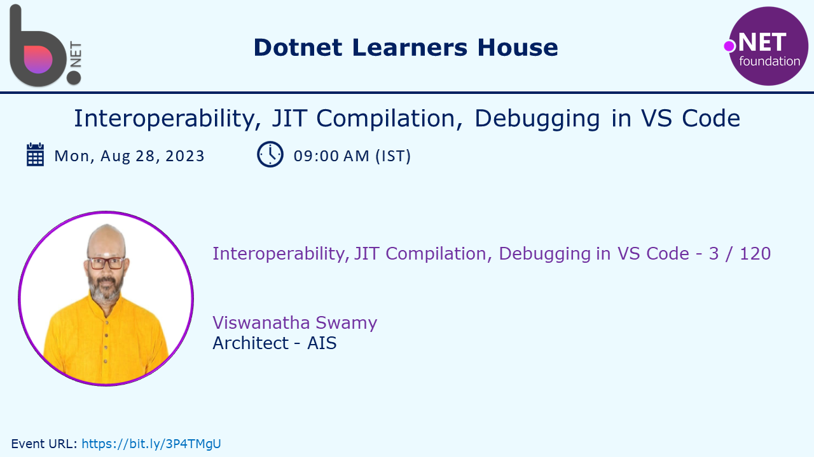
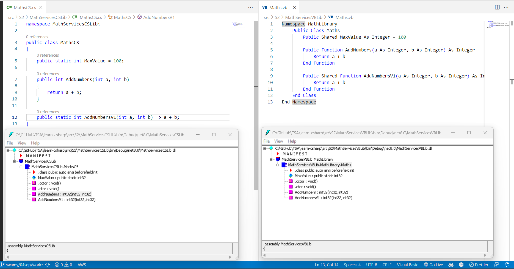
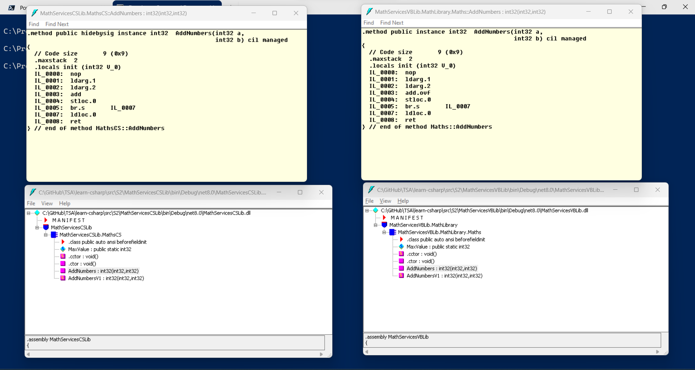

# Dive into Interoperability, and JIT Compilation, Debugging using VS Code - Part of Microservices Series 3/120

## Date: 11-Sep-2023

## Event URL: [https://www.meetup.com/dot-net-learners-house-hyderabad/events/295456840/](https://www.meetup.com/dot-net-learners-house-hyderabad/events/295456840/)

## YouTube URL: [https://www.youtube.com/watch?v=VxMY7FMm_JQ](https://www.youtube.com/watch?v=VxMY7FMm_JQ)

## Agenda for this session

> 1. Dive into "How it was possible to use VB.NET Library in C# Project?"
> 1. Dive into "JIT Compilation" Process
> 1. Showing Compiler Version `#error version`
> 1. Introduction to Variables
> 1. `Global namespace imports` feature
> 1. `File-scoped namespaces` feature
> 1. Creating a Console Application with .NET (6/7/8)
> 1. Creating a Console Application with global.json inside folder
> 1. Importing Namespaces
> 1. Multiple Projects
> 1. SUMMARY / RECAP / Q&A
> 1. What is next?

---

---

## X. Dive into understanding "How it was possible to use VB.NET Library in C# Project?"

> 1. Discussion and demo

**Reference(s):**

> 1. [https://learn.microsoft.com/en-us/dotnet/standard/common-type-system](https://learn.microsoft.com/en-us/dotnet/standard/common-type-system)
> 1. [https://learn.microsoft.com/en-us/dotnet/standard/language-independence](https://learn.microsoft.com/en-us/dotnet/standard/language-independence)
> 1. [https://learn.microsoft.com/en-us/dotnet/standard/base-types/common-type-system](https://learn.microsoft.com/en-us/dotnet/standard/base-types/common-type-system)
> 1. [https://learn.microsoft.com/en-us/dotnet/api/system.int32?view=net-7.0](https://learn.microsoft.com/en-us/dotnet/api/system.int32?view=net-7.0)

## X. Dive into understanding "What is Common Language Infrastructure?"

> 1. Discussion and demo

**Reference(s):**

> 1. [https://en.wikipedia.org/wiki/Common_Language_Infrastructure#Implementations](https://en.wikipedia.org/wiki/Common_Language_Infrastructure#Implementations)

## X. Dive into understanding "JIT Compilation" Process

> 1. Discussion and demo

**Reference(s):**

> 1. [https://en.wikipedia.org/wiki/Common_Language_Infrastructure#Implementations](https://en.wikipedia.org/wiki/Common_Language_Infrastructure#Implementations)

## X. SUMMARY / RECAP / Q&A

> 1. Discussion and Demo

---

## X. What is next ?

> 1. To be decided
> 1. SUMMARY / RECAP / Q&A
> 1. What is next ?
