# Dive into JIT Compilation, Console Apps in .NET 6/7/8, Primitive Types, and Type Conversions - Part of Microservices Series 4/120

## Date: 09-Oct-2023

## Event URL: [https://www.meetup.com/dot-net-learners-house-hyderabad/events/295456925/](https://www.meetup.com/dot-net-learners-house-hyderabad/events/295456925/)

## YouTube URL: [https://www.youtube.com/watch?v=v0ILq6yEnyg](https://www.youtube.com/watch?v=v0ILq6yEnyg)

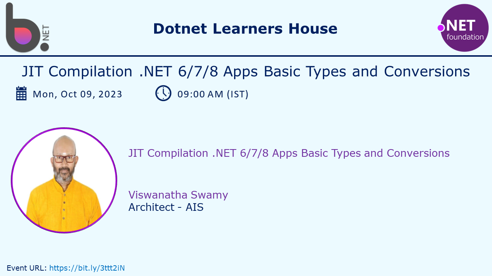

## Agenda for this session

> 1. Dive into "JIT Compilation" Process
> 1. Namespaces, and Importing Namespaces
>    - `Block-Scoped, File-scoped` namespaces feature
>    - Using namespace imports feature
>    - Globally importing namespaces
>    - Implicitly importing namespaces
> 1. Creating a Console Application with .NET (6/7/8)
> 1. Creating a Console Application with global.json inside the folder
> 1. Hands on with Basic / Primitive Types, and Constants
> 1. Type Inference / Implicitly Typed Local Variables, and Regions
> 1. SUMMARY / RECAP / Q&A
> 1. What is next ?

---


---

## 1. Dive into understanding "JIT Compilation" Process

> 1. Discussion and demo
> 1. The dotnet CLI tool utilizes the C# compiler, known as Roslyn, to transform your C# source code into intermediate language (IL) code, which is then stored within an assembly, typically a DLL or EXE file. IL code statements closely resemble assembly language instructions and are designed to be executed by .NET's virtual machine, CoreCLR. During runtime, CoreCLR loads the IL code from the assembly, followed by the just-in-time (JIT) compiler converting it into native CPU instructions, which are subsequently executed by your machine's CPU.
> 1. This two-step compilation process offers a significant advantage as it allows Microsoft to develop Common Language Runtimes (CLRs) for various operating systems, including Linux, macOS, and Windows. Thanks to the second compilation step, which generates code tailored to the native operating system and CPU instruction set, the same IL code functions seamlessly across all platforms. Irrespective of the programming language used for the source code, whether it's C#, Visual Basic, F#, etc., all .NET applications rely on IL code for their instructions, conveniently stored within an assembly. Microsoft and other entities also offer disassembler tools like the ILSpy .NET Decompiler extension, enabling you to open an assembly and uncover its IL code.

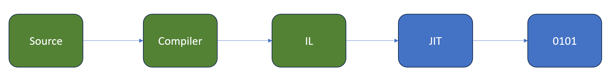

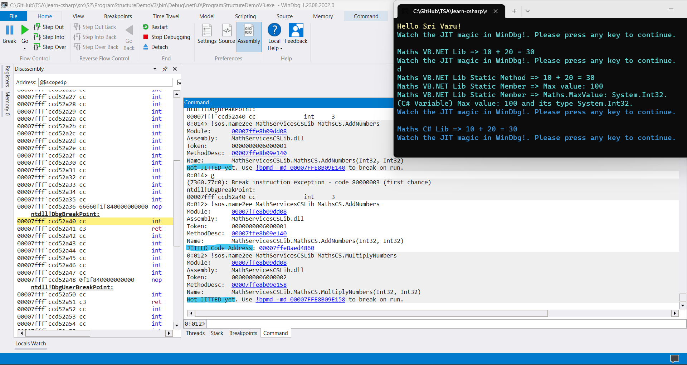

**Reference(s):**

> 1. [https://en.wikipedia.org/wiki/Common_Language_Infrastructure#Implementations](https://en.wikipedia.org/wiki/Common_Language_Infrastructure#Implementations)
> 1. [https://learn.microsoft.com/en-us/dotnet/standard/common-type-system](https://learn.microsoft.com/en-us/dotnet/standard/common-type-system)
> 1. [https://learn.microsoft.com/en-us/dotnet/standard/language-independence](https://learn.microsoft.com/en-us/dotnet/standard/language-independence)
> 1. [https://learn.microsoft.com/en-us/dotnet/standard/base-types/common-type-system](https://learn.microsoft.com/en-us/dotnet/standard/base-types/common-type-system)
> 1. [https://learn.microsoft.com/en-us/dotnet/api/system.int32?view=net-7.0](https://learn.microsoft.com/en-us/dotnet/api/system.int32?view=net-7.0)
> 1. [https://en.wikipedia.org/wiki/Common_Language_Infrastructure#Implementations](https://en.wikipedia.org/wiki/Common_Language_Infrastructure#Implementations)

## 2. Namespaces, and Importing Namespaces

> 1. Discussion and demo

### 2.1. `Block-Scoped, File-scoped` namespaces feature

> 1. Discussion and demo

### 2.2. Using namespace imports feature

> 1. Discussion and demo

### 2.3. Globally importing namespaces

> 1. Discussion and demo

### 2.4. Implicitly importing namespaces

> 1. Discussion and demo

## 3. Creating a Console Application with .NET (6/7/8)

> 1. Discussion and demo

### 3.1. Creating a Console Application with .NET 6

> 1. Discussion and demo

```powershell
dotnet new console -o net6demoapp -f net6.0

dotnet sln add .\net6demoapp\net6demoapp.csproj

dotnet run --project .\net6demoapp\net6demoapp.csproj
```

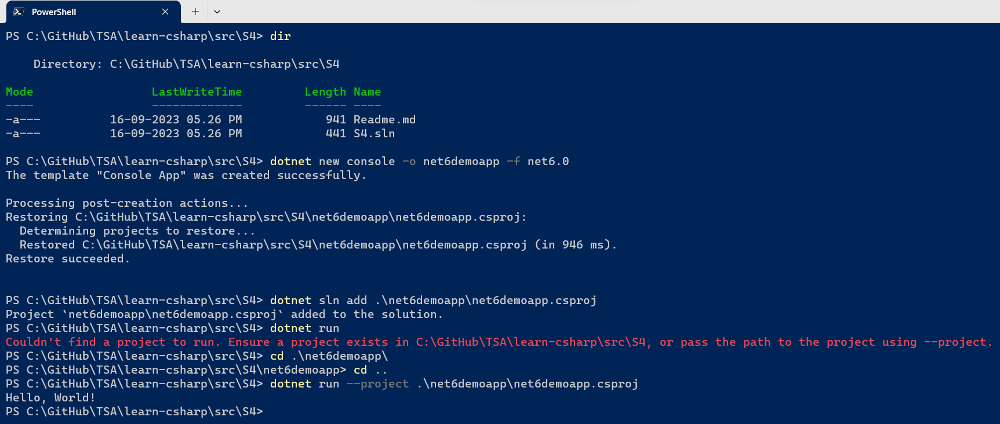

### 3.2. Creating a Console Application with .NET 7

> 1. Discussion and demo

```powershell
dotnet new console -o net7demoapp -f net7.0

dotnet sln add .\net7demoapp\net7demoapp.csproj

dotnet run --project .\net7demoapp\net7demoapp.csproj
```

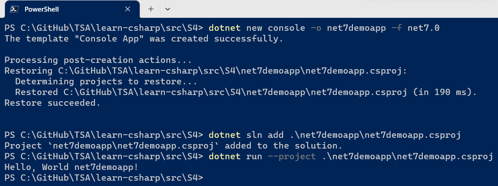

### 3.3. Creating a Console Application with .NET 8

> 1. Discussion and demo

```powershell
dotnet new console -o net8demoapp -f net8.0

dotnet sln add .\net8demoapp\net8demoapp.csproj

dotnet run --project .\net8demoapp\net8demoapp.csproj
```

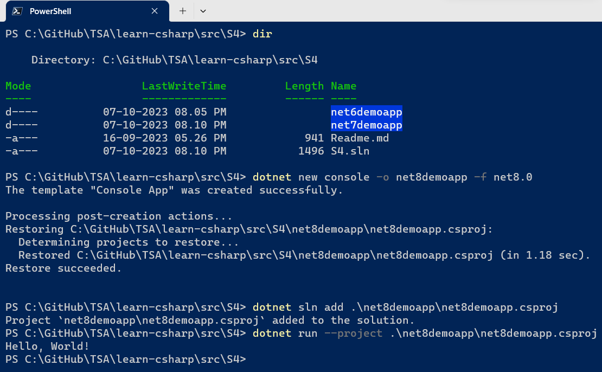

## 4. Creating a Console Application with global.json inside folder

> 1. Discussion and demo

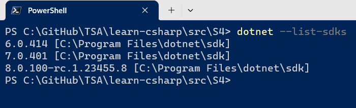

### 4.1. Creating a Console Application with .NET 6

> 1. Discussion and demo
> 1. Create a folder named `net6demoappv1`, change directory and open the folder in VS Code Terminal / Terminal
> 1. Run the below commands

```powershell
dotnet new globaljson --sdk-version 6.0.414

dotnet new console

cd ..

dotnet sln add .\net6demoappv1\net6demoappv1.csproj

dotnet run --project .\net6demoappv1\net6demoappv1.csproj
```

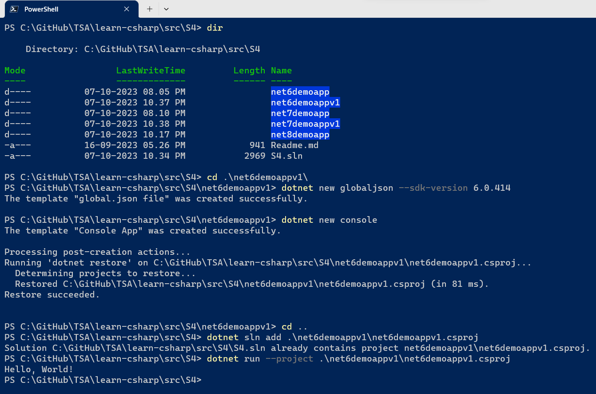

### 4.2. Creating a Console Application with .NET 7

> 1. Discussion and demo
> 1. Create a folder named `net7demoappv1`, change directory and open the folder in VS Code Terminal / Terminal
> 1. Run the below commands

```powershell
dotnet new globaljson --sdk-version 7.0.401

dotnet new console

cd ..

dotnet sln add .\net7demoappv1\net7demoappv1.csproj

dotnet run --project .\net7demoappv1\net7demoappv1.csproj
```

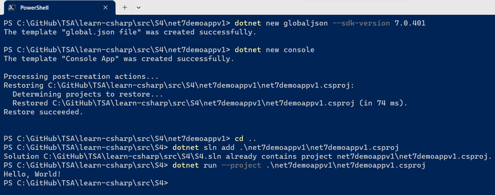

### 4.3. Creating a Console Application with .NET 8

> 1. Discussion and demo
> 1. Create a folder named `net8demoappv1`, change directory and open the folder in VS Code Terminal / Terminal
> 1. Run the below commands

```powershell
dotnet new globaljson --sdk-version 8.0.100-rc.1.23455.8

dotnet new console

cd ..

dotnet sln add .\net8demoappv1\net8demoappv1.csproj

dotnet run --project .\net8demoappv1\net8demoappv1.csproj
```

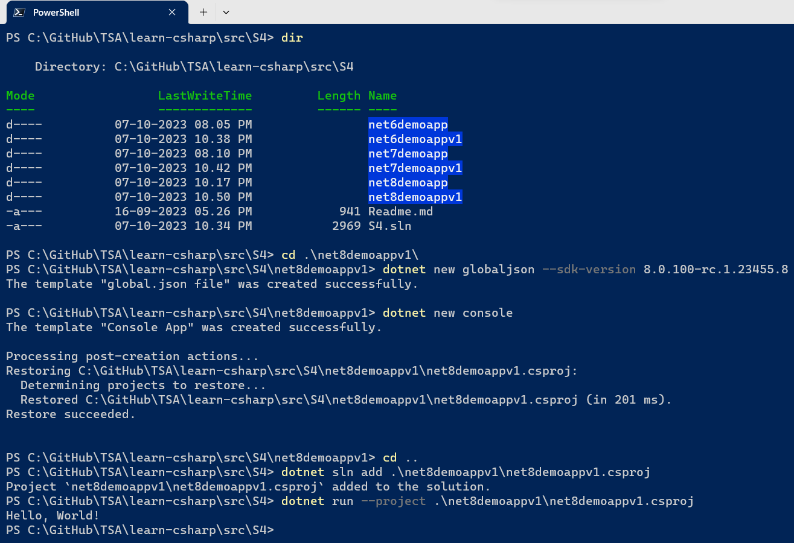

## 5. Hands on with Basic / Primitive Types, and Constants

> 1. Discussion and demo

```powershell
dotnet new console -o BuildInTypesDemo

dotnet sln add .\BuildInTypesDemo\BuildInTypesDemo.csproj

cd BuildInTypesDemo

dotnet add reference ../../Common/HeaderFooter/HeaderFooter.csproj

cd ..

dotnet run --project .\BuildInTypesDemo\BuildInTypesDemo.csproj
```

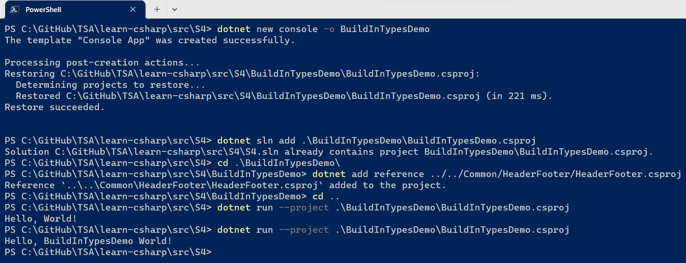

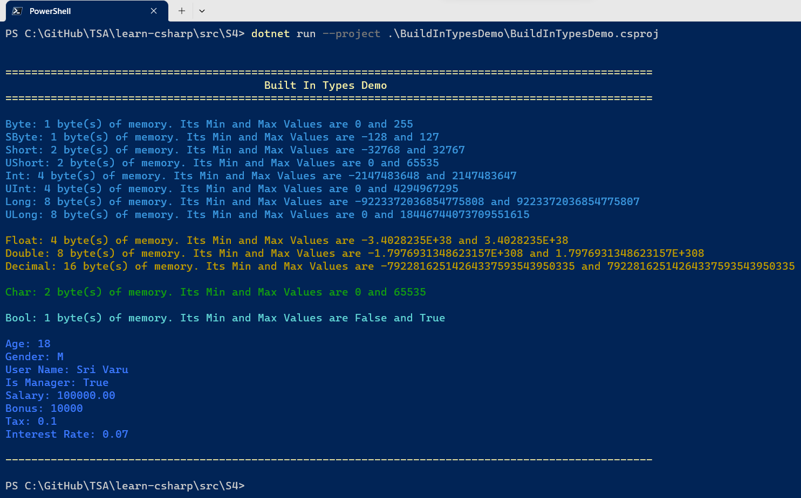

## 6. Type Inference / Implicitly Typed Local Variables, and Regions

> 1. Discussion and demo

```powershell
dotnet new console -o ImplicitlyTypedDemo

dotnet sln add .\ImplicitlyTypedDemo\ImplicitlyTypedDemo.csproj

cd ImplicitlyTypedDemo

dotnet add reference ../../Common/HeaderFooter/HeaderFooter.csproj

cd ..

dotnet run --project .\ImplicitlyTypedDemo\ImplicitlyTypedDemo.csproj
```

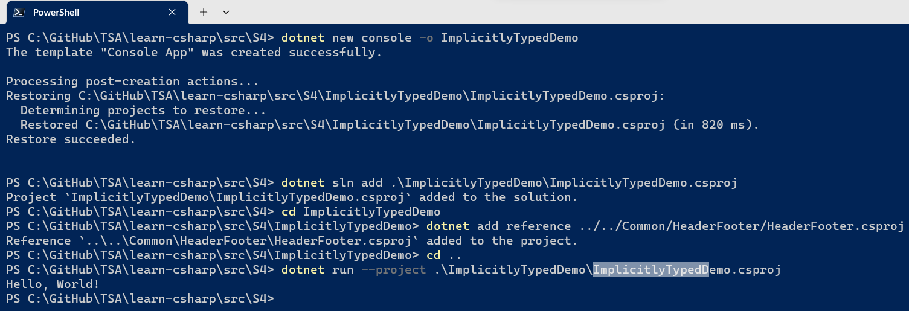

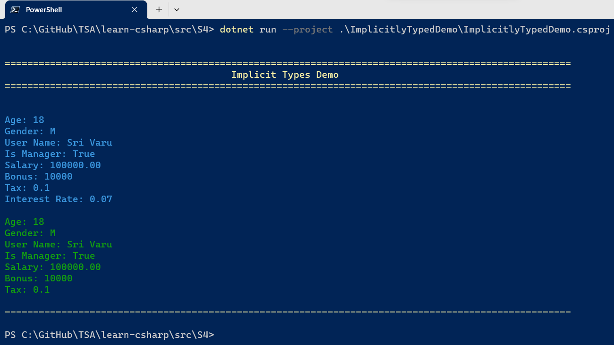

## X. SUMMARY / RECAP / Q&A

> 1. Discussion and Demo

---

## X. What is next ?

> 1. Global Using, Implicit Usings
> 1. Basic DataTypes, Its Ranges, and Build in members
> 1. DateTime, TimeSpan, and TimeZoneInfo
> 1. String, StringBuilder, and String Interpolation
> 1. Implicit, Explicit Conversions and Parsing
> 1. Boxing and Unboxing
> 1. Parsing and Formatting
> 1. SUMMARY / RECAP / Q&A
> 1. What is next ?
