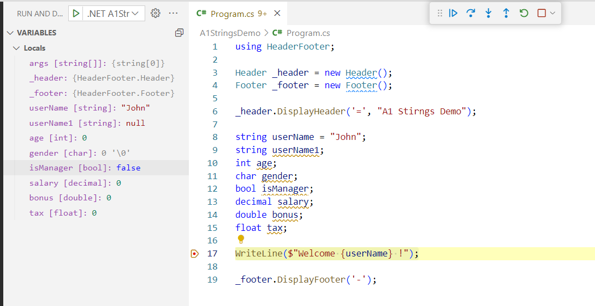

# 20 Jul 2023 Session

## Instructions and Commands

### 1. Create a new empty solution

> 1. Create a new solution `20230720`

```powershell
dotnet new sln -n 20230720
```

### 1.1. Create a new Project `A1DefaultValuesDemo`

> 1. Create a new project `A1DefaultValuesDemo`
> 1. Add a `HeaderFooter` reference to `A1DefaultValuesDemo` project
> 1. Add `A1DefaultValuesDemo` project to `20230720` solution

```powershell
dotnet new console -o A1DefaultValuesDemo
dotnet add reference ..\..\Common\HeaderFooter\HeaderFooter.csproj
dotnet sln add .\A2DefaultValuesDemo\A2DefaultValuesDemo.csproj
```

### 1.2. Create a new Project `A2StringsDemo`

> 1. Create a new project `A2StringsDemo`
> 1. Add a `HeaderFooter` reference to `A2StringsDemo` project
> 1. Add `A2StringsDemo` project to `20230720` solution

```powershell
dotnet new console -o A2StringsDemo
dotnet add reference ..\..\Common\HeaderFooter\HeaderFooter.csproj
dotnet sln add .\A1StringsDemo\A1StringsDemo.csproj
```

### 1.3. Create assets for Build and Run/Debug



#### tasks.json

> 1. Create a new file `tasks.json` in `.vscode` folder

```json
{
    "version": "2.0.0",
    "tasks": [
        {
            "label": "build",
            "command": "dotnet",
            "type": "process",
            "args": [
                "build",
                "${workspaceFolder}/20230720.sln",
                "/property:GenerateFullPaths=true",
                "/consoleloggerparameters:NoSummary"
            ],
            "problemMatcher": "$msCompile"
        },
        {
            "label": "publish",
            "command": "dotnet",
            "type": "process",
            "args": [
                "publish",
                "${workspaceFolder}/20230720.sln",
                "/property:GenerateFullPaths=true",
                "/consoleloggerparameters:NoSummary"
            ],
            "problemMatcher": "$msCompile"
        },
        {
            "label": "watch",
            "command": "dotnet",
            "type": "process",
            "args": [
                "watch",
                "run",
                "--project",
                "${workspaceFolder}/20230720.sln"
            ],
            "problemMatcher": "$msCompile"
        }
    ]
}
```

> 1. Create a new file `launch.json` in `.vscode` folder

```json
{
  // Use IntelliSense to learn about possible attributes.
  // Hover to view descriptions of existing attributes.
  // For more information, visit: https://go.microsoft.com/fwlink/?linkid=830387
  "version": "0.2.0",
  "configurations": [
    {
      // Use IntelliSense to find out which attributes exist for C# debugging
      // Use hover for the description of the existing attributes
      // For further information visit https://github.com/dotnet/vscode-csharp/blob/main/debugger-launchjson.md
      "name": ".NET A1StringsDemo (console)",
      "type": "coreclr",
      "request": "launch",
      "preLaunchTask": "build",
      // If you have changed target frameworks, make sure to update the program path.
      "program": "${workspaceFolder}/A1StringsDemo/bin/Debug/net8.0/A1StringsDemo.dll",
      "args": [],
      "cwd": "${workspaceFolder}/A1StringsDemo",
      // For more information about the 'console' field, see https://aka.ms/VSCode-CS-LaunchJson-Console
      "console": "internalConsole",
      "stopAtEntry": false
    },
    {
      // Use IntelliSense to find out which attributes exist for C# debugging
      // Use hover for the description of the existing attributes
      // For further information visit https://github.com/dotnet/vscode-csharp/blob/main/debugger-launchjson.md
      "name": ".NET A2DefaultValuesDemo (console)",
      "type": "coreclr",
      "request": "launch",
      "preLaunchTask": "build",
      // If you have changed target frameworks, make sure to update the program path.
      "program": "${workspaceFolder}/A2DefaultValuesDemo/bin/Debug/net8.0/A2DefaultValuesDemo.dll",
      "args": [],
      "cwd": "${workspaceFolder}/A2DefaultValuesDemo",
      // For more information about the 'console' field, see https://aka.ms/VSCode-CS-LaunchJson-Console
      "console": "internalConsole",
      "stopAtEntry": false
    },
    {
      "name": ".NET Core Attach",
      "type": "coreclr",
      "request": "attach"
    }
  ]
}
```

## Tips

```text
dotnet add:
  package <PACKAGE_NAME>    Add a NuGet package reference to the project.
  reference <PROJECT_PATH>  Add a project-to-project reference to the project.
```
